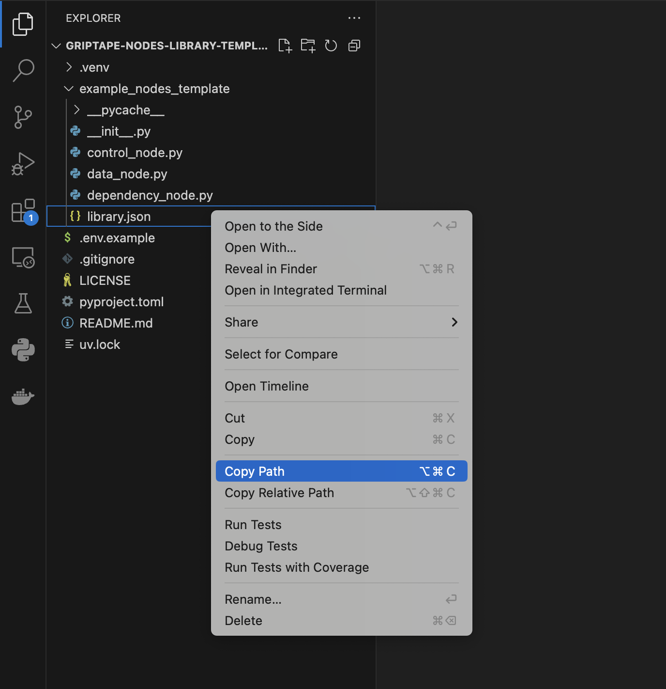

# Kling AI Video Nodes

This library provides Griptape Nodes for interacting with the Kling AI video generation services. You can use these nodes to generate videos from text prompts, images, extend existing videos, or create lip-sync videos.

**IMPORTANT:** To use these nodes, you will need API keys from Kling AI. Please visit the [Kling AI website](https://klingai.com) for more information on how to obtain your keys.

To configure your keys within the Griptape Nodes IDE:
1. Open the **Settings** menu.
2. Navigate to the **API Keys & Secrets** panel.
3. Add a new secret configuration for the service named `Kling`.
4. Enter your `KLING_ACCESS_KEY` and `KLING_SECRET_KEY` in the respective fields.

Below is a description of each node and its parameters.

### Kling AI Text to Video (`KlingAI_TextToVideo`)

Generates a video from a text prompt.

| Parameter                | Type    | Description                                                                                                | Default Value   |
|--------------------------|---------|------------------------------------------------------------------------------------------------------------|-----------------|
| `prompt`                 | `str`   | Text prompt for video generation (max 2500 chars).                                                         |                 |
| `model_name`             | `str`   | Model Name.                                                                                                | `kling-v1`      |
| `negative_prompt`        | `str`   | Negative text prompt (max 2500 chars).                                                                     | `""`            |
| `cfg_scale`              | `float` | Flexibility in video generation (0-1). Higher value = lower flexibility, stronger prompt relevance.        | `0.5`           |
| `mode`                   | `str`   | Video generation mode (`std`: Standard, `pro`: Professional).                                              | `std`           |
| `aspect_ratio`           | `str`   | Aspect ratio of the generated video frame (width:height). Choices: `16:9`, `9:16`, `1:1`.                    | `16:9`          |
| `duration`               | `str`   | Video Length, unit: s (seconds). Choices: `5`, `10`.                                                         | `5`             |
| `num_videos`             | `int`   | Number of videos to generate in parallel (1-5).                                                             | `1`             |
| `callback_url`           | `str`   | Callback notification address for task status changes.                                                     | `""`            |
| `external_task_id`       | `str`   | Customized Task ID (must be unique within user account).                                                   | `""`            |
| `camera_control_type`    | `str`   | Predefined camera movement type. Select `(Auto)` for model default. If `simple`, ensure only one config value is non-zero. Choices: `(Auto)`, `simple`, `down_back`, `forward_up`, `right_turn_forward`, `left_turn_forward`. | `(Auto)`        |
| `camera_config_horizontal`| `float` | Horizontal movement (-10 to 10). Use if `camera_control_type` is `simple`.                                 | `0.0`           |
| `camera_config_vertical` | `float` | Vertical movement (-10 to 10). Use if `camera_control_type` is `simple`.                                   | `0.0`           |
| `camera_config_pan`      | `float` | Pan (rotation around x-axis, -10 to 10). Use if `camera_control_type` is `simple`.                           | `0.0`           |
| `camera_config_tilt`     | `float` | Tilt (rotation around y-axis, -10 to 10). Use if `camera_control_type` is `simple`.                          | `0.0`           |
| `camera_config_roll`     | `float` | Roll (rotation around z-axis, -10 to 10). Use if `camera_control_type` is `simple`.                           | `0.0`           |
| `camera_config_zoom`     | `float` | Zoom (-10 to 10). Use if `camera_control_type` is `simple`.                                                  | `0.0`           |
| `video_url_0`             | `VideoUrlArtifact`       | **Output:** Video URL (index 0).                                                                                                                                                                                              | `None`        |
| `video_url_1`             | `VideoUrlArtifact`       | **Output:** Video URL (index 1).                                                                                                                                                                                              | `None`        |
| `video_url_2`             | `VideoUrlArtifact`       | **Output:** Video URL (index 2).                                                                                                                                                                                              | `None`        |
| `video_url_3`             | `VideoUrlArtifact`       | **Output:** Video URL (index 3).                                                                                                                                                                                              | `None`        |
| `video_url_4`             | `VideoUrlArtifact`       | **Output:** Video URL (index 4).                                                                                                                                                                                              | `None`        |
| `video_urls`              | `list[VideoUrlArtifact]` | **Output:** List of generated videos (completion order).                                                                                                                                                                      | `[]`          |

*Note: `Callback` and `Camera Controls` parameters are grouped and may be collapsed by default in the UI.*

**Multiple video generation:**  
Set `num_videos` to generate multiple videos in parallel. The first completed video is exposed in `video_url_0`, while all completed videos are returned in `video_urls` in completion order. When `num_videos` is `1`, `video_urls` contains a single item matching `video_url_0`.

### Kling AI Image to Video (`KlingAI_ImageToVideo`)

Generates a video from a reference image and optional text prompts.

| Parameter                 | Type                          | Description                                                                                                                               | Default Value   |
|---------------------------|-------------------------------|-------------------------------------------------------------------------------------------------------------------------------------------|-----------------|
| `image`                   | `ImageArtifact` / `str`       | Reference Image (required). Input `ImageArtifact`, `ImageUrlArtifact`, direct URL string, or Base64 string.                                |                 |
| `image_tail`              | `ImageArtifact` / `str`       | Reference Image - End frame control. Input `ImageArtifact`, `ImageUrlArtifact`, direct URL string, or Base64 string.                       | `None`          |
| `prompt`                  | `str`                         | Positive text prompt (max 2500 chars).                                                                                                    | `""`            |
| `negative_prompt`         | `str`                         | Negative text prompt (max 2500 chars).                                                                                                    | `""`            |
| `model_name`              | `str`                         | Model Name for generation. Choices: `kling-v1`, `kling-v1-5`, `kling-v1-6`.                                                                 | `kling-v1`      |
| `cfg_scale`               | `float`                       | Flexibility (0-1). Higher value = lower flexibility, stronger prompt relevance.                                                         | `0.5`           |
| `mode`                    | `str`                         | Video generation mode (`std`: Standard, `pro`: Professional).                                                                             | `std`           |
| `duration`                | `str`                         | Video Length in seconds. Choices: `5`, `10`.                                                                                                | `5`             |
| `num_videos`              | `int`                         | Number of videos to generate in parallel (1-5).                                                                                            | `1`             |
| `static_mask`             | `ImageArtifact` / `str`       | Static Brush Application Area. Input `ImageArtifact`, `ImageUrlArtifact`, direct URL, or Base64 string. Mutually exclusive with Camera Controls. | `None`          |
| `dynamic_masks`           | `str`                         | JSON string for Dynamic Brush Configuration List. Masks within JSON must be URL/Base64. Mutually exclusive with Camera Controls.          | `None`          |
| `camera_control_type`     | `str`                         | Predefined camera movement. `(Auto)` for model default. `simple` requires one config value. Mutually exclusive with Masks. Choices: `(Auto)`, `simple`, `down_back`, `forward_up`, `right_turn_forward`, `left_turn_forward`. | `(Auto)`        |
| `camera_config_horizontal`| `float`                       | Camera horizontal movement (-10 to 10). Use if type is `simple`.                                                                          | `0.0`           |
| `camera_config_vertical`  | `float`                       | Camera vertical movement (-10 to 10). Use if type is `simple`.                                                                            | `0.0`           |
| `camera_config_pan`       | `float`                       | Camera pan movement (-10 to 10). Use if type is `simple`.                                                                                 | `0.0`           |
| `camera_config_tilt`      | `float`                       | Camera tilt movement (-10 to 10). Use if type is `simple`.                                                                                | `0.0`           |
| `camera_config_roll`      | `float`                       | Camera roll movement (-10 to 10). Use if type is `simple`.                                                                                | `0.0`           |
| `camera_config_zoom`      | `float`                       | Camera zoom movement (-10 to 10). Use if type is `simple`.                                                                                | `0.0`           |
| `callback_url`            | `str`                         | Callback notification address for task status changes.                                                                                    | `""`            |
| `external_task_id`        | `str`                         | Customized Task ID (must be unique within user account).                                                                                  | `""`            |
| `video_url_0`             | `VideoUrlArtifact`       | **Output:** Output URL of the generated video (index 0).                                                                                                                                                                      | `None`        |
| `video_url_1`             | `VideoUrlArtifact`       | **Output:** Output URL of the generated video (index 1).                                                                                                                                                                      | `None`        |
| `video_url_2`             | `VideoUrlArtifact`       | **Output:** Output URL of the generated video (index 2).                                                                                                                                                                      | `None`        |
| `video_url_3`             | `VideoUrlArtifact`       | **Output:** Output URL of the generated video (index 3).                                                                                                                                                                      | `None`        |
| `video_url_4`             | `VideoUrlArtifact`       | **Output:** Output URL of the generated video (index 4).                                                                                                                                                                      | `None`        |
| `video_urls`              | `list[VideoUrlArtifact]` | **Output:** List of generated videos (completion order).                                                                                                                                                                      | `[]`          |

*Note: `Image Inputs`, `Prompts`, `Generation Settings`, `Masks`, `Camera Controls`, and `Callback` parameters are grouped and may be collapsed by default in the UI.*

**Multiple video generation:**  
Set `num_videos` to generate multiple videos in parallel. The first completed video is exposed in `video_url_0`, while all completed videos are returned in `video_urls` in completion order. When `num_videos` is `1`, `video_urls` contains a single item matching `video_url_0`.

### Kling AI Video Extension (`KlingAI_VideoExtension`)

Extends an existing Kling AI video.

| Parameter             | Type               | Description                                                                                       | Default Value |
|-----------------------|--------------------|---------------------------------------------------------------------------------------------------|---------------|
| `video_id`            | `str`              | Required. The ID of the Kling video to extend.                                                    |               |
| `prompt`              | `str`              | Optional. Text prompt for the extension (max 2500 chars).                                       | `""`          |
| `negative_prompt`     | `str`              | Optional. Negative text prompt (max 2500 chars).                                                  | `""`          |
| `cfg_scale`           | `float`            | Optional. Flexibility (0-1). Higher value = lower flexibility, stronger prompt relevance.       | `0.5`         |
| `callback_url`        | `str`              | Optional. Callback notification address for task status changes.                                  | `""`          |
| `external_task_id`    | `str`              | Optional. Customized Task ID for user tracking.                                                   | `""`          |
| `extended_video_url`  | `VideoUrlArtifact` | **Output:** URL of the extended video segment.                                                    | `None`        |
| `extended_video_id`   | `str`              | **Output:** ID of the newly generated extended video segment.                                     | `None`        |
| `extension_task_id`   | `str`              | **Output:** Task ID for the video extension job.                                                  | `None`        |

*Note: `Core Input`, `Prompts`, `Generation Settings`, and `Callback` parameters are grouped and may be collapsed by default in the UI.*

### Kling AI Lip Sync (`KlingAI_LipSync`)

Creates lip-sync videos by synchronizing speech to video. Supports both Kling AI generated videos (via video ID) and uploaded videos (via video URL).

| Parameter              | Type                         | Description                                                                                          | Default Value   |
|------------------------|------------------------------|------------------------------------------------------------------------------------------------------|-----------------|
| `video_input_type`     | `str`                        | Video input type. Choices: `video_id` (for Kling AI generated videos), `video_url` (for uploads).     | `video_id`      |
| `video_id`             | `str`                        | Video ID from previous Kling AI video generation (required when using `video_id` input type).         |                 |
| `video_url`            | `VideoUrlArtifact` / `str`   | Video file or URL for lip sync (required when using `video_url` input type).                          |                 |
| `voice_type`           | `str`                        | Voice input type. Choices: `text` (text-to-speech), `audio` (audio file).                             | `text`          |
| `voice_text`           | `str`                        | Text to convert to speech (used when `voice_type` is `text`).                                          | `""`            |
| `voice_audio_url`      | `str`                        | URL to audio file (used when `voice_type` is `audio`).                                                 | `""`            |
| `voice_speaker`        | `str`                        | TTS voice speaker (used when `voice_type` is `text`). Choices: `ai_shatang`, `ai_kaiya`, `ai_chenjiahao_712`, `ai_huangzhong_712`, `ai_huangyaoshi_712`, `ai_laoguowang_712`, `uk_boy1`, `uk_man2`, `uk_oldman3`, `oversea_male1`, `commercial_lady_en_f-v1`, `reader_en_m-v1`. | `ai_shatang`    |
| `voice_speed`          | `float`                      | Speech speed multiplier (0.5-2.0). 1.0 = normal speed.                                                | `1.0`           |
| `voice_volume`         | `float`                      | Speech volume multiplier (0.1-2.0). 1.0 = normal volume.                                              | `1.0`           |
| `callback_url`         | `str`                        | Callback notification address for task status changes.                                                 | `""`            |
| `lip_sync_video_url`   | `VideoUrlArtifact`           | **Output:** URL of the lip-synced video.                                                               | `None`          |
| `task_id`              | `str`                        | **Output:** The Task ID of the lip-sync video from Kling AI.                                           | `None`          |

*Note: `Video Input`, `Voice Settings`, `Text-to-Speech Settings`, and `Callback` parameters are grouped and may be collapsed by default in the UI.*

## Add your library to your installed Engine! 

If you haven't already installed your Griptape Nodes engine, follow the installation steps [HERE](https://github.com/griptape-ai/griptape-nodes).
After you've completed those and you have your engine up and running: 

1. Copy the path to your `griptape_nodes_library.json` file within this `kling` directory. Right click on the file, and `Copy Path` (Not `Copy Relative Path`).
   
2. Start up the engine! 
3. Navigate to settings.
   
4. Open your settings and go to the App Events tab. Add an item in **Libraries to Register**.
   
5. Paste your copied `griptape_nodes_library.json` path from earlier into the new item.
   
6. Exit out of Settings. It will save automatically! 
7. Open up the **Libraries** dropdown on the left sidebar.
   
8. Your newly registered library should appear! Drag and drop nodes to use them!
   
